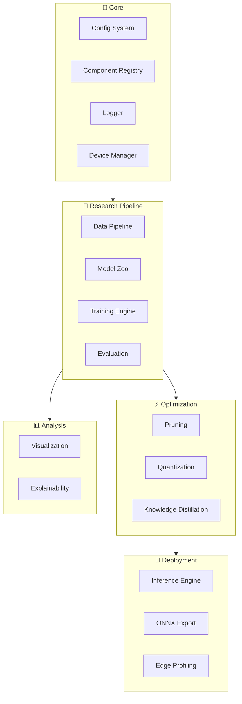

# 🧠 EdgeMind AI

**A Modular Framework for Efficient Deep Learning and Edge AI**

[](https://www.python.org/downloads/)
[](LICENSE)
[](https://peps.python.org/pep-0008/)

---

## Overview

EdgeMind AI is a research-oriented framework for studying and deploying efficient deep learning models on resource-constrained edge devices. It provides a modular pipeline covering the full lifecycle:

**Data → Model → Training → Compression → Inference → Deployment**

### Research Question

> *How can we systematically compress, optimize, and deploy deep learning models for resource-constrained edge environments while maintaining acceptable accuracy?*

---

## Architecture



---

## Key Features

| Feature | Description |
|---|---|
| 🏗️ **Modular Architecture** | Plug-and-play components with registry pattern |
| ⚙️ **Config-Driven Experiments** | YAML-based configuration for full reproducibility |
| 🔄 **Transfer Learning** | Pretrained backbone models (MobileNet, EfficientNet, ResNet) |
| ✂️ **Model Compression** | Pruning, quantization, knowledge distillation |
| 📏 **Edge Profiling** | Latency, memory, and FLOPs benchmarking |
| 🔍 **Explainability** | Grad-CAM, feature visualization |
| 📊 **Experiment Tracking** | Built-in logging and metric recording |

---

## Installation

```bash
# Clone the repository
git clone https://github.com/yourusername/edgemind-ai.git
cd edgemind-ai

# Create virtual environment (recommended)
python -m venv venv
venv\Scripts\activate    # Windows
# source venv/bin/activate  # Linux/macOS

# Install in development mode
pip install -e ".[dev]"
```

---

## Project Structure

```
edgemind-ai/
├── configs/              # YAML experiment configurations
├── edgemind/             # Main package
│   ├── core/             # Config, logging, registry, device
│   ├── models/           # Model zoo and backbones
│   ├── data/             # Data loading and augmentation
│   ├── training/         # Training engine and callbacks
│   ├── evaluation/       # Metrics and evaluation
│   ├── optimization/     # Pruning, quantization, distillation
│   ├── inference/        # Inference engine and export
│   ├── visualization/    # Plotting and visualization
│   ├── explainability/   # Grad-CAM, feature maps
│   └── utils/            # Shared utilities
├── tests/                # Unit tests
├── docs/                 # Documentation
└── notebooks/            # Colab notebooks
```

---

## Quick Start

```python
from edgemind.core.config import EdgeMindConfig
from edgemind.core.device import get_device_info

# Load experiment configuration
config = EdgeMindConfig.from_yaml("configs/base.yaml")
print(config.project.name)  # "EdgeMind AI"

# Check available hardware
device_info = get_device_info()
print(device_info)
```

---

## Research Objectives

1. **Systematic Model Compression** — Compare pruning, quantization, and distillation under controlled conditions
2. **Edge Deployment Analysis** — Profile inference latency and memory on simulated edge constraints
3. **Accuracy-Efficiency Trade-offs** — Map the Pareto frontier of accuracy vs. computational cost
4. **Reproducible Experiments** — Every experiment defined by a YAML config, every result logged

---

## Roadmap

- [x] Phase 1: Project Foundation & Architecture
- [ ] Phase 2: Data Pipeline
- [ ] Phase 3: Model Zoo & Transfer Learning
- [ ] Phase 4: Training Engine
- [ ] Phase 5: Model Compression & Optimization
- [ ] Phase 6: Inference Engine & Edge Simulation
- [ ] Phase 7: Explainability & Visualization
- [ ] Phase 8: Research Report & Demo App

---

## License

This project is licensed under the MIT License — see [LICENSE](LICENSE) for details.

---

## Citation

If you use EdgeMind AI in your research, please cite:

```bibtex
@software{edgemind2026,
    title={EdgeMind AI: A Modular Framework for Efficient Deep Learning and Edge AI},
    year={2026},
    url={https://github.com/yourusername/edgemind-ai}
}
```
