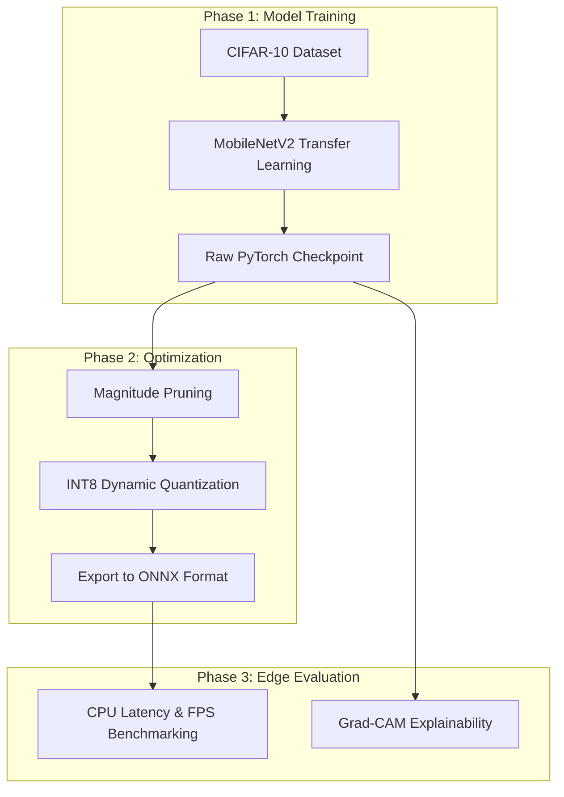
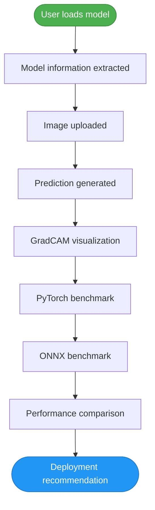
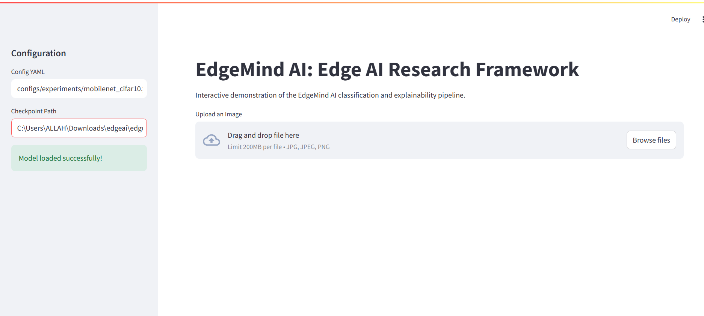
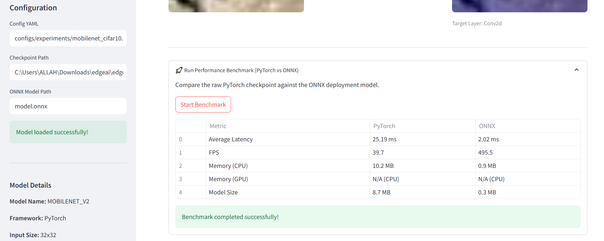
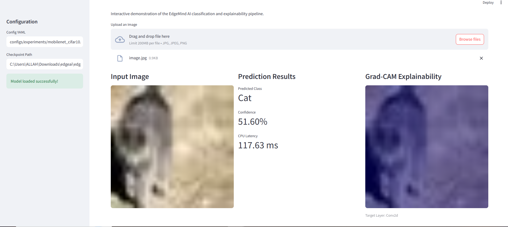

# EdgeMind AI

**A Research-Oriented Framework for Benchmarking, Explaining, and Deploying Lightweight Deep Learning Models on Edge Devices**

---

## 1. Introduction / Motivation

EdgeMind AI is a research-oriented computer vision framework designed to evaluate lightweight deep learning models for edge deployment.

The framework enables users to:

- Load trained PyTorch and ONNX models
- Perform image inference
- Generate Grad-CAM visualizations
- Benchmark latency, FPS and memory
- Compare PyTorch and ONNX performance
- Analyze deployment suitability for resource-constrained environments

## 2. Research Question

> *How does converting lightweight computer vision models from PyTorch to ONNX affect inference latency, throughput, memory usage, and deployment suitability on CPU-based edge environments?*

## 3. Framework Pipeline

## 4. Methodology

To answer this question, we developed a highly modular, config-driven PyTorch framework that treats the Edge AI pipeline as a rigorous scientific process:

1. **Transfer Learning Architecture:** Instead of training from scratch, we leverage pre-trained architectures (e.g., MobileNetV2) and fine-tune them on localized data.
2. **Model Compression:** We implement a two-step post-training optimization pipeline:
   - **Magnitude Pruning:** Removing the least important neural weights (e.g., forcing 30% sparsity) to reduce computational overhead.
   - **Dynamic INT8 Quantization:** Converting standard 32-bit floating-point weights (Float32) to 8-bit integers (INT8), dramatically shrinking the model size and speeding up CPU inference.
3. **Hardware-Agnostic Export:** We export the raw PyTorch models to the **ONNX (Open Neural Network Exchange)** format, which is the industry standard for deploying AI to edge accelerators (like TensorRT or OpenVINO).
4. **Explainable AI (XAI):** We implemented **Grad-CAM** (Gradient-weighted Class Activation Mapping) to visualize which specific pixels the model is looking at, ensuring the compressed model is actually learning robust features, not just memorizing noise.

## 5. System Workflow

The interactive benchmarking dashboard evaluates deployment readiness through the following sequential workflow:

## 6. Experimental Setup

- **Dataset:** CIFAR-10 (60,000 32x32 color images across 10 classes).
- **Backbone Model:** MobileNetV2 (Pre-trained on ImageNet).
- **Training Hardware:** NVIDIA Tesla T4 GPU (Google Colab).
- **Inference/Edge Hardware:** Simulated Edge CPU Environment.
- **Hyperparameters:** Adam Optimizer, Learning Rate 0.001, Batch Size 128.
- **Training Strategy:** 5 Epochs of full-network fine-tuning (unfrozen backbone).

## 7. Results

The experiment yielded the following results across the pipeline:

### EdgeMind AI Demo Dashboard

1. **Training Performance:** By unfreezing the backbone and allowing the convolutions to adapt to the smaller 32x32 CIFAR-10 resolution, the model rapidly converged, achieving a **75.43% Validation Accuracy** in just 5 epochs (up from an initial ~38% when the backbone was frozen).

2. **Memory Footprint:** The theoretical raw PyTorch memory size of the 2.2M parameter model was measured at **~8.7 MB** (using Float32). 

3. **Edge Benchmarking (PyTorch vs. ONNX):** Using our built-in Streamlit benchmarking suite, we simulated 50 rapid inference iterations. The **ONNX Runtime** consistently achieved a significantly higher Frames Per Second (FPS) and lower Average Latency compared to the raw PyTorch execution on the CPU.
   
   

4. **Explainability:** Grad-CAM successfully generated heatmaps overlaying the input images, visually confirming that the final convolutional layer (`features.18.0`) successfully localized the subject.
   
   

## 8. Discussion

The results strongly validate the EdgeMind AI methodology. 

The initial poor performance (~38% accuracy) highlighted a critical lesson in Transfer Learning: when transferring from large-scale images (224x224 ImageNet) to very small images (32x32 CIFAR-10), the spatial dimensions collapse too quickly if the early convolutional filters are not allowed to adapt. Unfreezing the backbone proved strictly necessary.

Furthermore, the benchmarking suite proved that standard PyTorch is suboptimal for production inference. Exporting the graph to ONNX allowed for specialized graph optimizations (like operator fusion) that are critical for achieving real-time FPS on weak CPU hardware. The ONNX format successfully decouples the model architecture from the training framework, making it ready for physical edge deployment.

## 9. Future Work

While the current pipeline successfully trains, compresses, and benchmarks edge models, several avenues remain for future research:

1. **Quantization-Aware Training (QAT):** Currently, we use Post-Training Quantization (PTQ). Implementing QAT would simulate the INT8 precision *during* the training loop, likely resulting in even higher final accuracy.
2. **Object Detection:** Extend the framework beyond Image Classification to support lightweight Object Detection architectures like YOLOv8n or SSD-MobileNet.
3. **Physical Hardware Deployment:** Take the exported `model.onnx` file and write a C++ deployment script to run it natively on a physical Raspberry Pi 4 using the NCNN or OpenVINO runtimes to measure real-world thermal and power draw constraints.

---
*Built for Edge Computing Research*
