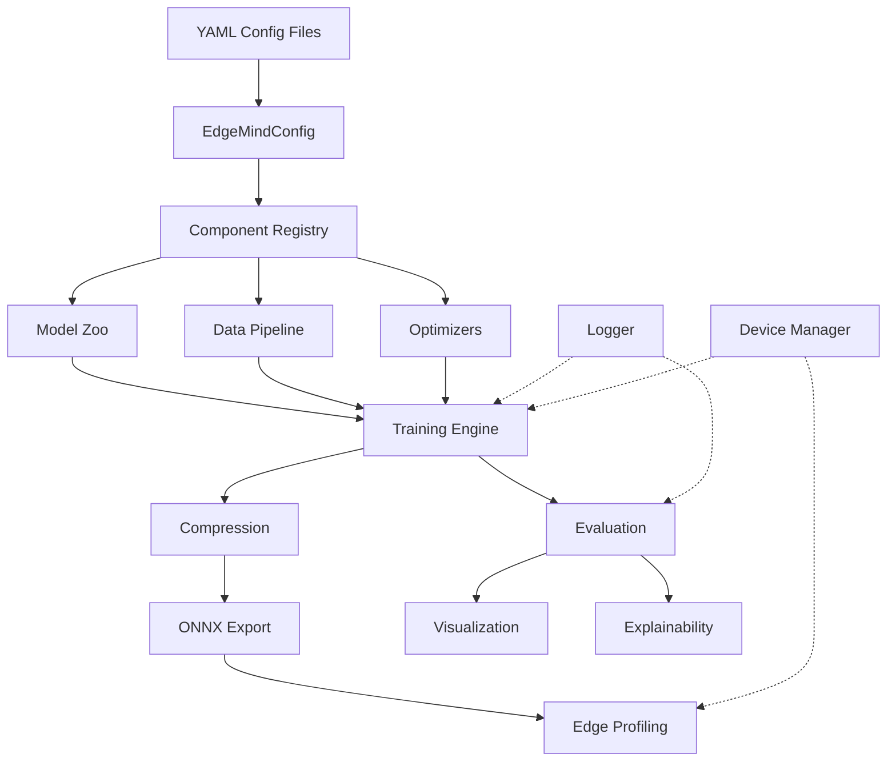

# EdgeMind AI — Architecture

## Design Philosophy

EdgeMind AI follows three core principles inspired by leading research frameworks:

### 1. Modularity (Inspired by OpenMMLab)

Every component (model, dataset, optimizer, scheduler) is a self-contained module that can be swapped, combined, or extended without touching other parts of the system.

```
edgemind/
├── core/          ← Foundation (config, registry, logging, device)
├── models/        ← Model definitions and pretrained backbones
├── data/          ← Dataset loading and augmentation pipelines
├── training/      ← Training loops, callbacks, and experiment tracking
├── evaluation/    ← Metrics and model comparison
├── optimization/  ← Pruning, quantization, knowledge distillation
├── inference/     ← ONNX export, runtime inference
├── visualization/ ← Plotting and result visualization
├── explainability/← Grad-CAM, feature maps
└── utils/         ← Shared helper functions
```

### 2. Config-Driven Experiments (Inspired by Detectron2)

Every experiment is fully defined by a YAML configuration file. This enables:

- **Reproducibility**: Re-run any experiment by pointing to its config
- **Comparison**: Diff two configs to see exactly what changed
- **Tracking**: Configs are logged alongside results

```yaml
# configs/experiments/my_experiment.yaml
model:
  name: "mobilenet_v2"
  num_classes: 10
training:
  epochs: 20
  learning_rate: 0.001
```

### 3. Registry Pattern (Inspired by timm)

Components register themselves by name. Configs reference components as strings, and the registry resolves them at runtime.

```python
MODELS = Registry("models")

@MODELS.register("mobilenet_v2")
class MobileNetV2Wrapper:
    ...

# In training code:
model = MODELS.build(config.model)
```

## System Architecture



## Key Design Decisions

| Decision | Rationale |
|---|---|
| YAML over JSON/TOML | Industry standard in ML research, supports comments |
| Registry over if/elif | Scalable, decoupled, same as FAIR/OpenMMLab |
| `pip install -e .` | Importable from anywhere, proper Python packaging |
| `rich` for logging | Beautiful console output, zero performance cost |
| `dataclasses` for structs | Clean, typed, built into Python 3.7+ |
